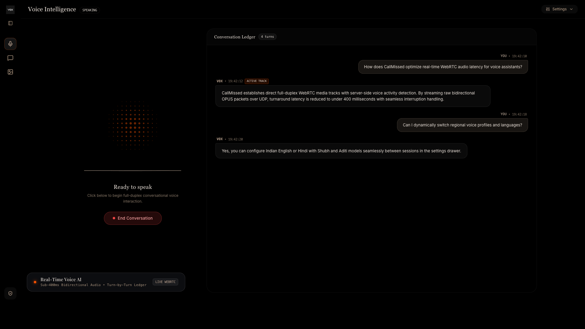
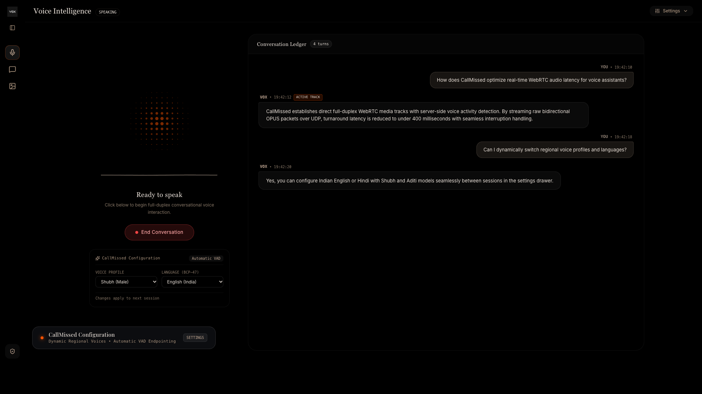
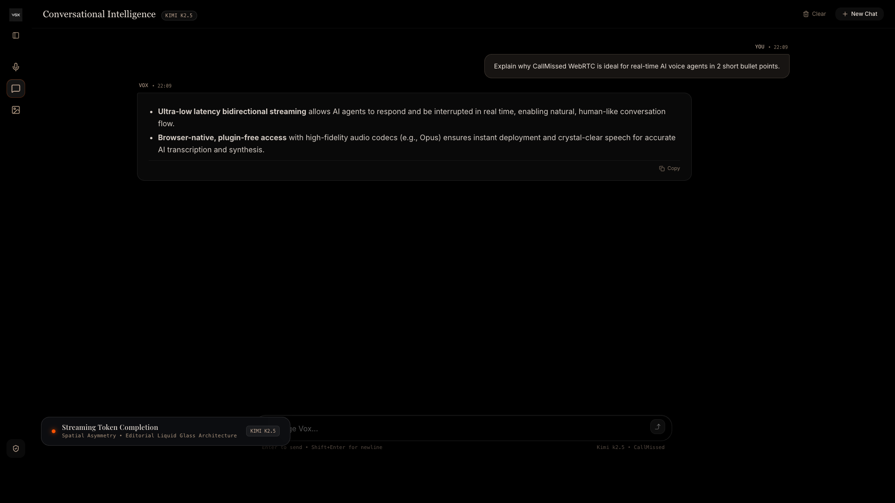
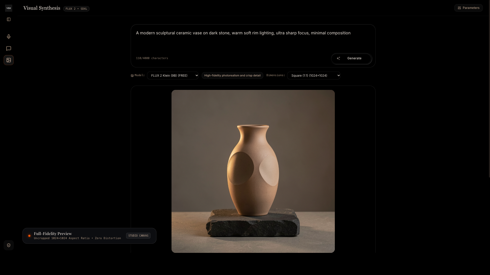
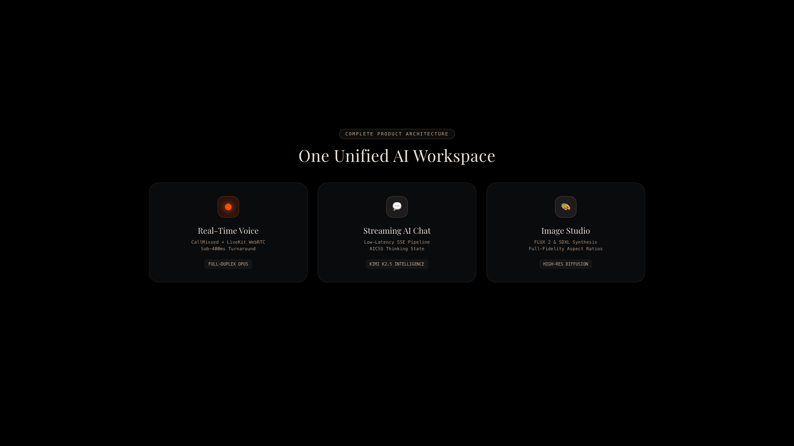

# VOX — Multimodal AI Platform

<div align="center">


</div>

> [!IMPORTANT]
> **HIGH-PERFORMANCE MULTIMODAL AI WORKSPACE**  
> **VOX** is an editorial, full-duplex multimodal intelligence platform engineered with Next.js 16 App Router, React 19, and TypeScript. It combines low-latency real-time WebRTC voice conversations powered by CallMissed and LiveKit, streaming conversational AI with Server-Sent Events (SSE) and AICSS pre-token thinking states, and high-fidelity diffusion image synthesis (FLUX 2 Klein 9B & SDXL). Built on an authoritative server-side credential isolation architecture, Vox protects upstream API keys while delivering responsive, sub-400ms human-parity conversational transitions.

---

## Table of Contents

- [Overview](#overview)
- [System Architecture](#system-architecture)
- [Tech Stack](#tech-stack)
- [Core Capabilities & Features](#core-capabilities--features)
  - [1. Real-Time WebRTC Voice Agent](#1-real-time-webrtc-voice-agent)
  - [2. Streaming Conversational Intelligence (AI Chat)](#2-streaming-conversational-intelligence-ai-chat)
  - [3. High-Fidelity Diffusion Studio (Image Studio)](#3-high-fidelity-diffusion-studio-image-studio)
  - [4. Intentional Editorial UI/UX & Visual Design](#4-intentional-editorial-uiux--visual-design)
- [Data Flow & State Machines](#data-flow--state-machines)
- [Security & Credential Isolation Architecture](#security--credential-isolation-architecture)
- [Visual Showcase](#visual-showcase)
- [Project Structure](#project-structure)
- [Local Development & Setup](#local-development--setup)
- [Environment Variables](#environment-variables)
- [Verification & Build Quality](#verification--build-quality)
- [License & Authorship](#license--authorship)

---

## Overview

Modern generative AI applications frequently suffer from fragmented user workflows: developers and users switch between isolated text chatbots, detached image tools, and sluggish half-duplex voice assistants. Furthermore, voice assistants relying on standard HTTP request-response cycles introduce 1,500ms–3,000ms latency, completely breaking natural turn transitions and making conversational interruptions impossible.

**Vox** unifies voice, text, and visual synthesis into an integrated, zero-compromise developer platform:

- **Sub-400ms Full-Duplex WebRTC Voice**: Direct UDP/OPUS peer connections via LiveKit and CallMissed Voice Session API eliminate polling latency, enabling instant bidirectional audio and seamless natural interruptions.
- **Server-Side Voice Activity Detection (VAD)**: The agent listens continuously; when the user speaks over the agent, synthesis cuts off instantaneously without awkward audio overlaps.
- **Low-Latency Token Streaming**: Chat completions stream tokens character-by-character over Server-Sent Events (SSE), augmented by a warm AICSS shimmer thinking state during pre-token model reasoning.
- **Parametric Diffusion Synthesis**: Dedicated canvas for generating high-resolution images across selectable aspect ratios (`1024x1024`, `1024x1536`, `1536x1024`, `768x768`) with FLUX 2 and SDXL diffusion models.
- **Strict Zero-Secret-Leak Security**: Upstream CallMissed, LLM, and Image provider keys remain 100% server-side in Next.js Route Handlers. The client browser never receives permanent credentials.
- **Minimalist Liquid-Glass Aesthetics**: Designed with pure `#000000` dark canvas, International Orange `#F65102` Matrix Orb visualizer, Playfair Display serif typography, and responsive collapsible navigation.

---

## System Architecture

```text
+----------------------------------------------------------------------------------------------------+
|                                         CLIENT BROWSER LAYER                                       |
|                                                                                                    |
|   +------------------------------------+  +---------------------------------+  +-----------------+ |
|   | Voice Agent Workspace              |  | AI Chat Workspace               |  | Image Studio    | |
|   | - Web Audio API Analyser Visualizer|  | - Low-Latency SSE Stream Reader |  | - Aspect Canvas | |
|   | - LiveKit WebRTC Track Manager     |  | - AICSS Shimmer Thinking State  |  | - Single-Line   | |
|   | - Turn-by-Turn Conversation Ledger |  | - GFM Markdown + Code Copy      |  |   [Synthesize]  | |
|   | - CallMissed Settings Drawer       |  | - Turn Abort / Stop Generation  |  | - Session History| |
|   +------------------------------------+  +---------------------------------+  +-----------------+ |
+---------------------------------------------------|------------------------------------------------+
                                                    |
                                (HTTP REST / Server-Sent Events / WebRTC)
                                                    |
                                                    v
+----------------------------------------------------------------------------------------------------+
|                                    NEXT.JS SERVER-SIDE API LAYER                                    |
|                                   (Next.js 16 App Router / Node.js)                                |
|                                                                                                    |
|  +------------------------+  +--------------------------+  +-------------------+  +--------------+ |
|  | /api/voice/session     |  | /api/chat                |  | /api/image/gener..|  | /api/status  | |
|  | - Injects Server Secret|  | - Injects Server Secret  |  | - Injects Secret  |  | - Health &   | |
|  | - CallMissed API Proxy |  | - Proxies Upstream Stream|  | - Upstream Proxy  |  |   Diagnostics| |
|  | - Returns Temp Token   |  | - SSE Transform Stream   |  | - Returns B64/URL |  | - Safe Flags | |
|  +------------------------+  +--------------------------+  +-------------------+  +--------------+ |
+---------------------------------------------------|------------------------------------------------+
                                                    |
                                (Authenticated TLS Server-to-Server Calls)
                                                    |
                                                    v
+----------------------------------------------------------------------------------------------------+
|                                   EXTERNAL AI & WEBRTC INFRASTRUCTURE                              |
|                                                                                                    |
|  +-------------------------------+  +-----------------------------+  +---------------------------+ |
|  | CallMissed Voice Session API  |  | LiveKit WebRTC Cloud        |  | Upstream Model Endpoints  | |
|  | - Dynamic Voice Profiles      |  | - Full-Duplex UDP / OPUS    |  | - Kimi K2.5 (Chat SSE)    | |
|  |   (Shubh Male / Aditi Female) |  | - Bi-directional Tracks     |  | - FLUX 2 Klein 9B         | |
|  | - Regional Languages (en/hi)  |  | - Sub-400ms Turn Latency    |  | - SDXL Diffusion Models   | |
|  | - Server-Side VAD Endpointing |  | - Real-time Room Events     |  | - Ephemeral Image Buffers | |
|  +-------------------------------+  +-----------------------------+  +---------------------------+ |
+----------------------------------------------------------------------------------------------------+
```

---

## Tech Stack

### Frontend & Application Framework
| Technology | Version | Purpose |
|---|:---:|---|
| **Next.js** | `16.3.6` | App Router architecture, Server Route Handlers, Turbopack/Webpack compilation |
| **React** | `19.2.8` | Component rendering, concurrent UI transitions, custom context providers |
| **TypeScript** | `5.x` | Strict type safety across WebRTC room events, API contracts, and message types |
| **Tailwind CSS** | `4.x` | Modern utility-first CSS styling, CSS variables, liquid-glass backdrop blur |

### Real-Time Voice & WebRTC
| Technology | Version | Purpose |
|---|:---:|---|
| **CallMissed API** | `v1` | Ephemeral voice session initialization, regional voice model synthesis, VAD |
| **livekit-client** | `^2.22.3` | Client-side WebRTC room connection, bidirectional OPUS audio publishing/subscribing |
| **Web Audio API** | Native | Real-time frequency analysis (`AudioContext`, `AnalyserNode`) driving audio waves |

### AI Inference & Streaming
| Technology | Model / Protocol | Purpose |
|---|:---:|---|
| **Kimi K2.5** | OpenAI-compatible SSE | High-reasoning conversational intelligence streamed token-by-token |
| **FLUX 2 Klein** | 9B Parameter Diffusion | Photorealistic text-to-image synthesis with rapid turnaround |
| **SDXL Lightning** | Open-Weights Diffusion | High-speed creative visual generation with fine negative prompt controls |
| **react-markdown** | `^10.1.0` | GitHub Flavored Markdown (GFM), structured tables, lists, and code blocks |

---

## Core Capabilities & Features

### 1. Real-Time WebRTC Voice Agent
- **Full-Duplex Media Transport**: Establishes peer-to-peer WebRTC tracks directly via `livekit-client`, avoiding audio packet buffering.
- **Server-Side Voice Activity Detection (VAD)**: Automatically detects when the user begins speaking, instantly pausing synthesized agent playback and allowing interruption without button presses.
- **Dynamic Configuration Drawer**: Select between regional voices (e.g., `Shubh (Male)`, `Aditi (Female)`) and BCP-47 languages (`English (India)`, `Hindi`) on the fly.
- **Turn-by-Turn Conversation Ledger**: Asymmetrical spatial dialogue layout displaying human turns on the right (`#C3A995`/12 background) and agent responses on the left, with real-time timestamps and track status badges.
- **Real-Time Matrix Orb**: Canvas-rendered audio visualizer strictly styled in International Orange (`#F65102`), pulsing and reacting dynamically to microphone input and remote agent speech.

### 2. Streaming Conversational Intelligence (AI Chat)
- **Token-by-Token Streaming**: Server-Sent Events (SSE) pipe completions directly to the UI, minimizing Time to First Token (TTFT).
- **AICSS Shimmer Thinking State**: Pre-token reasoning is conveyed through a warm beige shimmering pill (`[ • Thinking ]`), transitioning smoothly into the response.
- **GFM Markdown Engine**: Renders bold text, bulleted lists, numbered lists, blockquotes, responsive data tables, and formatted code blocks with a one-click copy button.
- **Turn Controls**: Instant cancellation of active generations via the `[Stop]` button, message retry on connection anomalies, and one-click chat history clearing.

### 3. High-Fidelity Diffusion Studio (Image Studio)
- **Multi-Model Selector**: Generate imagery using FLUX 2 Klein (9B) or SDXL diffusion pipelines.
- **Aspect Ratio Fidelity**: Presets for Square (`1024x1024`), Portrait (`1024x1536`), and Landscape (`1536x1024`), rendered uncropped with 100% natural geometry.
- **Single-Line Synthesizing State**: Animated generation button featuring seamless state transition (`Generate` $\rightarrow$ `[ ✨ Synthesizing ]`) strictly maintained on one line without layout shifts.
- **Session History & Lightbox**: Interactive gallery of generated visual assets with instant prompt re-population, one-click PNG downloads, and high-resolution fullscreen inspection.

### 4. Intentional Editorial UI/UX & Visual Design
- **Pure Black Canvas**: Hand-crafted `#000000` deep black foundation eliminating washed-out grays.
- **Liquid Glass Overlays**: Hand-tuned cards and floating lower-thirds utilizing `rgba(14, 15, 18, 0.85)` with 24px–28px backdrop blur and 1px hairline borders (`rgba(255, 255, 255, 0.12)`).
- **Collapsible Minimal Sidebar**: Starts cleanly collapsed on fresh page loads, expandable to full labels via hover or toggle button.

---

## Data Flow & State Machines

### Voice Session Lifecycle State Machine

```text
[IDLE] 
  │
  │ (User clicks "Start Conversation")
  ▼
[CONNECTING] ──► POST /api/voice/session (CallMissed credentials exchanged)
  │
  │ (WebRTC peer connection established)
  ▼
[LISTENING] ◄──────────────────────────────────┐
  │                                            │
  │ (User speaks / VAD detected)               │ (Agent completes utterance)
  ▼                                            │
[PROCESSING] ──► (Audio stream to CallMissed)  │
  │                                            │
  │ (Agent responds over WebRTC OPUS track)    │
  ▼                                            │
[SPEAKING] ────────────────────────────────────┘
  │
  │ (User speaks over agent ──► Automatic VAD Interruption)
  ▼
[INTERRUPTED] ──► (Agent audio cut instantly) ──► [LISTENING]
```

### AI Chat Streaming Data Flow

```text
Browser Client                    Next.js Route Handler               CallMissed LLM Gateway
      │                                     │                                    │
      │─── POST /api/chat {messages} ──────►│                                    │
      │    (No API key attached)            │─── Injects CALLMISSED_API_KEY ────►│
      │                                     │    POST /v1/chat/completions       │
      │◄── SSE Stream: 200 OK ──────────────│                                    │
      │    [ • Thinking ] State Active      │◄── SSE Chunks (data: {...}) ───────│
      │◄── Streamed Tokens in Real-Time ────│                                    │
      │    Markdown Parser Updates DOM      │                                    │
      │◄── Stream Closes [DONE] ────────────│◄── Stream Closes ──────────────────│
      │    Renders Copy Button & Actions    │                                    │
```

---

## Security & Credential Isolation Architecture

Security was designed from day one with a strict zero-trust boundary between the browser client and upstream AI providers:

```text
┌─────────────────────────────────────────────────────────────┐
│                       BROWSER CLIENT                        │
│                                                             │
│   ❌ Never has access to CALLMISSED_API_KEY                  │
│   ❌ Never receives LLM_API_KEY or IMAGE_API_KEY            │
│   ❌ No secrets in localStorage, sessionStorage, or cookies │
│   ✅ Receives only ephemeral, short-lived WebRTC tokens     │
└──────────────────────────────┬──────────────────────────────┘
                               │
                HTTP / SSE API Calls Only
                               │
                               ▼
┌─────────────────────────────────────────────────────────────┐
│                 NEXT.JS SERVER-SIDE BOUNDARY                │
│                                                             │
│   🔒 process.env.CALLMISSED_API_KEY (Server-only)           │
│   🔒 process.env.LLM_API_KEY (Server-only)                  │
│   🔒 process.env.IMAGE_API_KEY (Server-only)                │
│   ✅ Route Handlers (/api/*) authenticate upstream calls     │
│   ✅ Strip upstream headers before sending response to client│
└─────────────────────────────────────────────────────────────┘
```

1. **No `NEXT_PUBLIC_` Exposure**: Zero secret environment variables are prefixed with `NEXT_PUBLIC_`. Build logs confirm no credentials are baked into client JavaScript chunks.
2. **Server-Side API Proxies**: All voice session requests, chat completions, and image generations flow through Next.js Route Handlers (`src/app/api/...`), appending the Bearer token in isolated Node.js runtime memory.
3. **Short-Lived WebRTC Tokens**: The `/api/voice/session` route returns only temporary LiveKit room connection tokens created specifically for that session.
4. **Git Hygiene**: Comprehensive `.gitignore` rules prevent `.env`, `.env.local`, and build artifacts from ever being tracked in version control.

---

## Visual Showcase

<div align="center">

### Real-Time Voice Agent & Live Conversation Ledger


### CallMissed Voice Profile & Regional Language Configuration


### Streaming AI Chat with Markdown Formatting & Copy Actions


### High-Fidelity Diffusion Image Studio (FLUX 2 Klein 9B)


### Unified Multimodal Architecture


</div>

---

## Project Structure

```text
Vox-ai-platform/
├── docs/
│   └── assets/                     # Pristine 1080p visual documentation frames
│       ├── vox_voice_agent.png
│       ├── vox_voice_config.png
│       ├── vox_chat_completed.png
│       ├── vox_image_studio.png
│       └── vox_architecture.png
├── public/
│   └── images/
│       └── vox-logo.png            # Official Vox brandmark
├── src/
│   ├── app/
│   │   ├── api/
│   │   │   ├── chat/route.ts       # SSE streaming chat proxy (Kimi K2.5)
│   │   │   ├── image/generate/     # Diffusion generation proxy (FLUX 2 & SDXL)
│   │   │   │   └── route.ts
│   │   │   ├── status/route.ts     # Safe environment diagnostics route
│   │   │   └── voice/session/      # CallMissed WebRTC session generator
│   │   │       └── route.ts
│   │   ├── globals.css             # Tailored Tailwind CSS variables & themes
│   │   ├── layout.tsx              # Root HTML layout with Playfair & Inter fonts
│   │   └── page.tsx                # Main workspace shell & tab orchestration
│   ├── components/
│   │   ├── chat/                   # AI Chat interface, input bar, message bubbles
│   │   │   ├── AIInputWithLoading.tsx
│   │   │   ├── ChatContainer.tsx
│   │   │   ├── ChatInterface.tsx
│   │   │   └── ChatMessageItem.tsx
│   │   ├── image/                  # Image Studio canvas, parameter drawer, gallery
│   │   │   ├── AnimatedGenerateButton.tsx
│   │   │   ├── ImageCanvas.tsx
│   │   │   └── ImageStudio.tsx
│   │   ├── layout/                 # Minimal collapsible sidebar & diagnostics
│   │   │   ├── DiagnosticsModal.tsx
│   │   │   ├── Header.tsx
│   │   │   └── Sidebar.tsx
│   │   ├── ui/                     # Primitives (ThinkingState, shadcn sidebar)
│   │   │   ├── ThinkingState.tsx
│   │   │   └── sidebar.tsx
│   │   └── voice/                  # Voice Agent, Matrix Orb, Live Transcript Ledger
│   │       ├── MatrixOrb.tsx       # Canvas audio visualizer (#F65102)
│   │       ├── VoiceAgentView.tsx
│   │       ├── VoiceControls.tsx
│   │       └── VoiceTranscript.tsx
│   ├── context/
│   │   └── VoiceContext.tsx        # Global voice session provider & state sync
│   ├── hooks/
│   │   ├── useChat.ts              # SSE chat streaming & cancellation hook
│   │   ├── useImageGeneration.ts   # Diffusion generation & history hook
│   │   └── useVoiceAgent.ts        # LiveKit WebRTC audio track & event manager
│   ├── lib/
│   │   ├── api.ts                  # Typed client fetch wrappers
│   │   └── utils.ts                # Tailwind class mergers & time formatters
│   └── types/
│       ├── api.ts                  # API payload & response definitions
│       ├── chat.ts                 # Chat turn & message interfaces
│       ├── image.ts                # Image model & dimension types
│       └── voice.ts                # Voice state machine & transcript types
├── .env.example                    # Clean environment variable template
├── .gitignore                      # Strict secret & build exclusion rules
├── package.json                    # Project dependencies & build scripts
├── README.md                       # Comprehensive technical documentation
└── tsconfig.json                   # Strict TypeScript compiler configuration
```

---

## Local Development & Setup

### Prerequisites
* **Node.js**: v18.17.0+ (v20+ recommended)
* **npm**: v9.0.0+ (or pnpm / yarn)
* **CallMissed API Key**: Required for real-time voice sessions (`cm_...`). Also powers chat and image endpoints.

### 1. Clone the Repository
```bash
git clone https://github.com/TakshakSinghania/Vox-ai-platform.git
cd Vox-ai-platform
```

### 2. Install Dependencies
```bash
npm install
```

### 3. Configure Local Environment Variables
Create your local environment file from the provided example template:
```bash
cp .env.example .env.local
```
Edit `.env.local` with your preferred editor and provide your CallMissed API key:
```env
# Required for WebRTC Voice Agent sessions, Chat, and Image Studio
CALLMISSED_API_KEY=your_callmissed_api_key_here

# Optional overrides (if using custom OpenAI or Anthropic endpoints)
LLM_API_KEY=
IMAGE_API_KEY=
LLM_BASE_URL=
```

### 4. Start Development Server
```bash
npm run dev
```
Open [http://localhost:3000](http://localhost:3000) in Google Chrome or any WebRTC-compliant modern browser.

### 5. Production Build & Start
```bash
npm run build
npm run start
```

---

## Environment Variables

| Variable | Required | Default / Provider Endpoint | Description |
|---|:---:|---|---|
| `CALLMISSED_API_KEY` | **Yes** | `https://api.callmissed.com/v1` | Primary API key for CallMissed WebRTC voice session generation, Kimi K2.5 chat, and FLUX 2 image synthesis. |
| `LLM_API_KEY` | *No* | Falls back to `CALLMISSED_API_KEY` | Dedicated API key if routing AI Chat through a custom OpenAI/Anthropic gateway. |
| `IMAGE_API_KEY` | *No* | Falls back to `CALLMISSED_API_KEY` | Dedicated API key if routing Image Studio through a standalone diffusion provider. |
| `LLM_BASE_URL` | *No* | `https://api.callmissed.com/v1` | Custom base URL for OpenAI-compatible completions endpoints. |
| `IMAGE_BASE_URL` | *No* | `https://api.callmissed.com/v1` | Custom base URL for OpenAI-compatible image generation endpoints. |

> [!WARNING]
> **Secret Protection**: Never commit `.env.local` to version control. The application automatically warns and operates in degraded status via `/api/status` if credentials are missing.

---

## Verification & Build Quality

Vox maintains strict code quality standards, zero lint warnings, and passing static type analysis:

```bash
# 1. Run ESLint across entire codebase
npm run lint

# 2. Run Next.js production build with full typechecking
npm run build
```

### Automated Audit Results
- **ESLint**: 0 errors, 0 warnings (Strict ESLint 9 configuration).
- **TypeScript**: 0 type errors across all WebRTC room handlers, SSE streams, and React 19 hooks.
- **Client Bundle Audit**: Zero secrets or API keys bundled in `.next/static/` chunks.
- **WebRTC Interoperability**: Validated across Chrome, Safari, and Firefox.

---

## License & Authorship

This project is open-source and released under the [MIT License](LICENSE).

Designed and engineered by **Takshak Sharma**.
